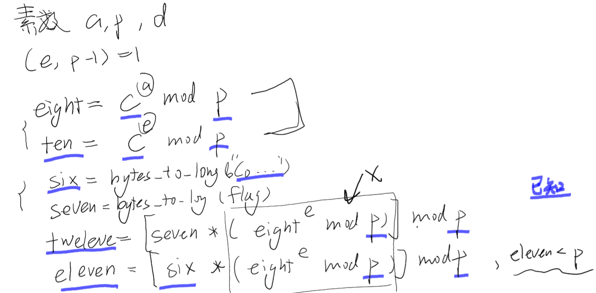

## CoCo
### 题目描述
文件：b5574201c88c73ac00b4e5d32b317339_NTURE.zip
（使用百度云文件发放的）（是不是以后会员岂不是有优势……？？？）

challenge.py：
```python {.line-numbers}
from Crypto.Util.number import *
from Crypto.Random.random import *
from flag import flag

Co = getStrongPrime(1024)
CoCo = getStrongPrime(1024)
CoCoCo = getStrongPrime(1024)

def CoCoCoCo(Co, CoCo):
    while CoCo: Co, CoCo = CoCo, Co % CoCo
    return Co

def CoCoCoCoCo(Co, CoCo, CoCoCo):
    CoCoCoCo = 1
    while CoCo != 0:
        if (CoCo & 1) == 1:
            CoCoCoCo = (CoCoCoCo * Co) % CoCoCo
        CoCo >>= 1
        Co = (Co * Co) % CoCoCo
    return CoCoCoCo

CoCoCoCoCoCoCoCo = CoCoCoCoCo(CoCoCo, Co, CoCo)
while True:
    CoCoCoCoCoCoCoCoCo = randint(1, 2 ** 512)
    if CoCoCoCo(CoCoCoCoCoCoCoCoCo, CoCo - 1) == 1:
        break

CoCoCoCoCoCo = bytes_to_long("CoCoCoCoCoCoCoCoCoCoCoCoCoCoCoCoCoCoCoCoCoCoCoCo")
CoCoCoCoCoCoCoCoCoCo = CoCoCoCoCo(CoCoCo, CoCoCoCoCoCoCoCoCo, CoCo)
CoCoCoCoCoCoCoCoCoCoCo = (CoCoCoCoCoCo * CoCoCoCoCo(CoCoCoCoCoCoCoCo, CoCoCoCoCoCoCoCoCo, CoCo)) % CoCo
CoCoCoCoCoCoCo = bytes_to_long(flag)
CoCoCoCoCoCoCoCoCoCoCoCo = (CoCoCoCoCoCoCo * CoCoCoCoCo(CoCoCoCoCoCoCoCo, CoCoCoCoCoCoCoCoCo, CoCo)) % CoCo
with open('cipher.txt', 'w') as f:
    f.write("CoCoCoCoCoCoCoCoCoCo = " + str(CoCoCoCoCoCoCoCoCoCo) + "\n")
    f.write("CoCoCo = " + str(CoCoCo) + "\n")
    f.write("CoCoCoCoCoCoCoCoCoCoCo = " + str(CoCoCoCoCoCoCoCoCoCoCo) + "\n")
    f.write("CoCo = " + str(CoCo) + "\n")
    f.write("CoCoCoCoCoCoCoCoCoCoCoCo = " + str(CoCoCoCoCoCoCoCoCoCoCoCo) + "\n")
```
cipher.txt:
```
CoCoCoCoCoCoCoCoCoCo = 112376755434839067242492450580926874835238627566940029196532175644877689078482714802636681537478746972878719135123815462672622666337365766404438579837929587693947036556506459672209528097159093195480318719604062458476883089712408549646871208319887232708573834573129807851612788612229862109446349174773685766921
CoCoCo = 151397348765463697819328127490368915291237595957138740365628078489836085372845681091989345334904026246892900348971981402476845038743843701086311667536372419728644485998870855126715225674611022660290971207449534822797616008980284083777280866124762176520095351401654370256535990768524594118090702757650148363921
CoCoCoCoCoCoCoCoCoCoCo = 120085813769601903784459580746767828105716607333492124010803514777437504109331448009890874939858984666641139819379969714070220763093188551966830630639308142299719976258227450642141963425187429636880593480951498406380068747404115889400485463839002674872020074254287490910994729347868122864760194135575038263365
CoCo = 133694097868622092961596455982173439482901807533684907590429464542321832157724052684517499871073826858762297729480414306161113412741865099163152505447334863097434932940729269605986418443532208942119505043634990271717198694190123478547503837269948205839761848366722796091382894026537012764323367229104988051357
CoCoCoCoCoCoCoCoCoCoCoCo = 53913320010474614353771348695262553935361078517742942745359182152882204780769206005474818637010209561420480280523029509375286538886061621596249179407728697515399046471231513536340506648832858695583318765423245104561512700887050932667507358898646356134386213016528778706360147066411877832628237361011621917972
```

### 分析与解
#### Coco
变量的命名丧心病狂……
姑且用数目代替原来的名字：
```
e.g. CoCoCo -> three
    CoCoCoCoCoCo -> twelve
```
由于数容易数错，替换也会因为短的是长的前缀，所以不能一键替换，也要仔细数。
当然用 Python `len()/2` + `复制` 更好。
> 题目用这种方式主要目的可能还是为了掩盖变量对应的含义。
#### 函数理解
代码中有两个函数：
```python {.line-numbers}
def CoCoCoCo(Co, CoCo):
    while CoCo: Co, CoCo = CoCo, Co % CoCo
    return Co

def CoCoCoCoCo(Co, CoCo, CoCoCo):
    CoCoCoCo = 1
    while CoCo != 0:
        if (CoCo & 1) == 1:
            CoCoCoCo = (CoCoCoCo * Co) % CoCoCo
        CoCo >>= 1
        Co = (Co * Co) % CoCoCo
    return CoCoCoCo
```
第一个函数一眼就可以看出来是欧几里得算法。
`Co, CoCo = CoCo, Co % CoCo`是欧几里得算法的理论基础。
第二个看得很熟悉，但是当时没有立刻搞懂……（导致后面的理解很受挫……）
> `>>=` 是向右移位一位，但是操作数只能是整数（所以相当于除以2，小数部分直接舍去）

回头看的时候想起来是当时 ACM 上的[快速求幂取模](https://blog.csdn.net/qq_32680617/article/details/50640622)……

> 为了增加代码可读性，我们用 `gmpy2.gcd(a,b)` 代替 ` CoCoCoCo(Co, CoCo)`；用 `pow(a, b, n) ` 代替 `CoCoCoCoCo(Co, CoCo, CoCoCo)`。
> 最后需要深刻反思…… ACMer 的优势。这周开始刷数论的算法题，看《算法竞赛入门》的数量部分

#### 分析和调整代码
知道了函数的作用（尤其发现和数论直接相关），整个代码的基本功能就能很好地理解。
但是代码的毛病不止是变量的命名，还有顺序：函数放在中间是什么意思？？？+一些代码调换位置会更容易看懂。
此外，刚刚也说了只是姑且用数目代替原来的名字……
需要根据代码的意义去分析:

```python {.line-numbers}
from Crypto.Util.number import *
from Crypto.Random.random import *
from flag import flag
import gmpy2

a = getStrongPrime(1024)
p = getStrongPrime(1024)
c = getStrongPrime(1024)

while True:# get a number(n) enable (n-1, random-e) = 1
    e = randint(1, 2 ** 512) # 1- 2 ** 512 之间
    if gmpy2.gcd(e, p - 1) == 1:
        break

eight = pow(c, a, p)
ten = pow(c, e, p)

six = bytes_to_long(b"CoCoCoCoCoCoCoCoCoCoCoCoCoCoCoCoCoCoCoCoCoCoCoCo")
seven = bytes_to_long(flag)

eleven = (six * pow(eight, e, p)) % p
twelve = (seven * pow(eight, e, p)) % p

with open('cipher.txt', 'w') as f: # 写进文件
    f.write("CoCoCoCoCoCoCoCoCoCo = " + str(ten) + "\n")
    f.write("CoCoCo = " + str(c) + "\n")
    f.write("CoCoCoCoCoCoCoCoCoCoCo = " + str(eleven) + "\n")
    f.write("CoCo = " + str(p) + "\n")
    f.write("CoCoCoCoCoCoCoCoCoCoCoCo = " + str(twelve) + "\n")

# two - p
# (e, n - 1) == 1
# three - c
# one - a
# nine - e
```
确实是一个浩大的工程……（一共十二个变量）
做了多次调整…… Orz
其中印象很深的是 p:
在 RSA 的模数一般是 n，所以会想当然地把最后定为 p 的变量（CoCo）最开始当成 n。
但是一直让我费解的是：`gmpy2.gcd(e, CoCo - 1) == 1;`

$\because (e, \varphi (m))=1 $ 而 $ \varphi (m) = \varphi (pq) = (p-1)(q-1)$
$\therefore (e, (p-1))=1$

基于这一点，所以我就猜想 CoCo 其实不是 n，而是 p。

#### 数学分析
回头想想，在道题和 RSA 其实没有什么关系。
用 RSA 常用的库并不一定是 RSA 算法……
这道题更像是自己设计的加密算法，所以纯粹靠自己进行数学分析。

##### 条件：

1. $ a, n, d 为素数 $
1. $ (e, n-1) = 1 $
1. $ eight \equiv d^a\pmod n $
1. $ ten \equiv d^e\pmod n $
1. `six = bytes_to_long(b'CoCoCoCoCoCoCoCoCoCoCoCoCoCoCoCoCoCoCoCoCoCoCoCo') `
1. `seven = bytes_to long(flag)`
1. $ tweleve = [{seven (eight^e \, mod \,p)}] \, mod \, p $
1. $ eleven = [{six (eight^e \, mod \,p)}] \, mod \, p $

草稿：


##### 分析-比赛思路
分成两个大类：前面三个和后面四个式子。
如果前面能推算出 $eight^e$ ，flag 应该也是迎刃而解（也许吧）
如果通过$ eleven = [{six (eight^e \, mod \,p)}] \, mod \, p $ 解出 $eight^e$ 也是完事大吉。
第一个如果推算并不成功……
第二个推算可得：
$$
eight^e \mod p = \frac{eleven+kp}{six}, k \in Z
$$
直接穷举计算量太大……尝试缩小范围。
$$
eight^e = \frac{eleven+kp}{six} < p  \;\; \land k \in Z
$$
然而，计算了一下：$k<\frac{p sinx -eleven}{p}$ k 是 $10^{115}$级别的……

那么尝试结合两大类式子能否进一步缩小枚举的范围？
………………（漫长）
………………（的）
………………（实验）
甚至开始怀疑数学能力……
##### 灵感和正解
本来决定去 Wiki、Google 上看看有没有类似的东西（当然没有）
记得之前一道奇妙的“数学题”条件没有用完一直让我耿耿于怀，这次碰巧看到一个博客是讲那道题目的：
[Codegate CTF 2018 - RSAbaby](http://blog.cirq.me/2018/02/07/Codegate2018-rsababy/)
其中一句话点醒了我：“真正的crypter对于题目的直觉令人十分惊异：h参数看起来太奇怪了，所以直接无视它！看到这里也只能怪自己的高考思维了，毕竟现实世界中，不是每一个条件都是有用的嘛。”
于是猛回头解题，重新审视。

开始完全关注后面两个式子
1. $ tweleve = [{seven (eight^e \, mod \,p)}] \, mod \, p $
1. $ eleven = [{six (eight^e \, mod \,p)}] \, mod \, p $
其实他们是两个同余方程。

如果！
把 $(eight^e \, mod \,p)$看成一个整体，而不是想要求出 $eight^e$，角度完全不同。
复杂的式子变得极度简单，不妨设 $x = (eight^e \, mod \,p)$.
1. $ tweleve = [{seven \cdot x}] \, mod \, p $
1. $ eleven = [{six \cdot x}] \, mod \, p $

变成两个同余方程。
其中第二个式子只有一个未知变量x，求出来之后第一个式子也就变成一元一次的同余方程。
```python {.line-numbers}
import gmpy2
from Crypto.Util.number import *
from Crypto.Random.random import *

six = bytes_to_long(b"CoCoCoCoCoCoCoCoCoCoCoCoCoCoCoCoCoCoCoCoCoCoCoCo")
eleven = 120085813769601903784459580746767828105716607333492124010803514777437504109331448009890874939858984666641139819379969714070220763093188551966830630639308142299719976258227450642141963425187429636880593480951498406380068747404115889400485463839002674872020074254287490910994729347868122864760194135575038263365
tweleve = 53913320010474614353771348695262553935361078517742942745359182152882204780769206005474818637010209561420480280523029509375286538886061621596249179407728697515399046471231513536340506648832858695583318765423245104561512700887050932667507358898646356134386213016528778706360147066411877832628237361011621917972

p = 133694097868622092961596455982173439482901807533684907590429464542321832157724052684517499871073826858762297729480414306161113412741865099163152505447334863097434932940729269605986418443532208942119505043634990271717198694190123478547503837269948205839761848366722796091382894026537012764323367229104988051357
x = gmpy2.invert(gmpy2.mpz(six), gmpy2.mpz(p)) * gmpy2.mpz(eleven)
tweleve= gmpy2.invert(gmpy2.mpz(x), gmpy2.mpz(p)) *gmpy2.mpz(tweleve)
tweleve %= p
flag  = long_to_bytes(tweleve)
print(flag)
```
> b'flag{394191c7-261c-4ecb-a1bd-a6440639f217}'

需要注意的是： invert() 这个函数返回的值不是那么理想，没有注意到这一点的我，第一次解出的 flag 很奇怪：
```
b"#&\xd1?_T\xdd\xb1!\x11\x00`V\rI{\xb0\t\x8eW=<z\xfeq\x1f\xfa\xca\xfd\x93mx\xe71\x0f\xa2\x1fD\x06H/}\xe1_\x1b\x87+\xa1\xb0\xcb\xe6\xfa\r\xdbt\xa6\x95g'x\xe2\x0b\xa2.\x08N\xcc\xa3\xd1\xba\x82\xa2,\xdeW1\x1b\x8e\x88\x97\xde\xf5E\x8a\xf1r\xedU\x9e\xe1\xb6\xc0\x1d\xc1\x85\x1b\x96J\x9bJm}\xb0\x9a\xc5\x04\x9b\x1duo\x11&7\xa0U\x96\xb1h\xe7\x1d8rwY8v\x92\xd9:\x9e6\xd9\xb0\xea.\xe0\x89\xd0|\xfd\xf6\x96Tg\x87\xaew\x9eH!\x87\xb7\xd6\x1d\xcf/&E\xae\x056hd\xe2\xbd\x81{\xc1(P\xd1\x14?\x13(r\xd0D\x1d\xfe$\xf6z}\x82u\xf2F#\xdb-\x18\xce\x94\xf2\x87\xfd\x86\xe3 \\\x87\x8b\xf12:p\xea\x02b\x05\xe6L)\xbd<,\x15\x89\xc6I\xde\x96B\xf5\xda>`\x15rC\xeed\xb1{\xf9\xba'y\xb0Wv(z\xa8\x95?\xa9J\x10\x06s#\xca\x89\xd0"
```
但是带回去验算又没有问题。
通过对比的对 six 进行 `bytes_to_long` 和 `long_to_bytes` 实验，发现 flag 比 six 大非常非常多……
所以才想是 invert() 的问题， 所以再 `tweleve %= p` 了一遍，然后转回字符串，终于成功。
在比赛结束前三十多米秒提交。

### 题目特点
1. 用恶心的变量名去掩盖变量真实的含义
1. 不是特殊的加密算法，是自己编造的加密方法，没有资料和经验，完全依靠数学和想象力。

## 比赛体验
自己还是不够格，五六个小时才解决一道题，其中一只怀疑自己的能力解决不了。
但是不知道什么时候心里默默立了一个 flag，这次比赛一定要解决一道题目！
绝望的时候吃了一顿饭，两点思考无力的时候趴了一下，醒来的时候精神好多了，斗志十足。

比赛最有趣的事情是，你不知道自己能不能行，不知道自己的知识储备是否足够，没有已经存在的解题方法，没有参考答案，每一步都在挑战自己和未知。

需要提升的是：
1. 算法能力（ACM 数论题）
1. 更多这样的历练